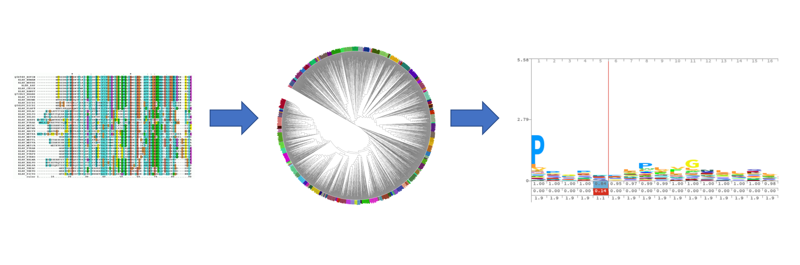

# build_subpfam
Build per-clade pHMM models from a collection of
aligned protein sequences (in a multifasta format).

Clades are programmatically defined by cutting a
mid-rooted, laderized, and ultrametricized phylogenetic
tree of the aligned sequences by a specified length
point.

**Usage**
under construction
